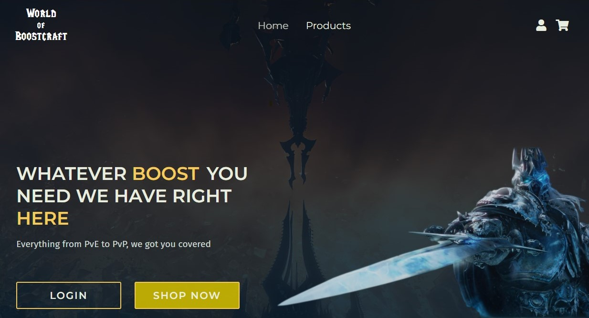

# World of Boostcraft - E-commerce



## Description
The goal with this was to:
- Make an fully responsive e-commerce website with semantic and neat design.
- Successfully login using jwt tokens from a strapi user which redirects you to an admin page where only authorized users can do things.
- Update, create, post and delete products from the Admin page.
- Search filter for the list of products.

E-commerce site made by with vanilla JavaScript, HTML and CSS. This was a school project and has some features missing that were not part of the tasks. Strapi was used as an API to get products/users and local storage to save it.

## Built with
- Vanilla JS, HTML and Sass
- Local Strapi

---

## Getting Started

### Installing

1. Clone the repo:

- Clone the repo however you would like to

2. Clone the Strapi:

- You will also need to clone and run the Strapi locally
-https://github.com/Krane96/strapi-sp2


3. Install the dependencies:

```
npm install
```

### Running

To run the app, run the following commands:


```bash
npm start
```

You will need to run the strapi with the following command:

```bash
npm run develop
```

## Contact

[My LinkedIn page](https://www.linkedin.com/in/martin-lian-krane-b2bb19210/)
